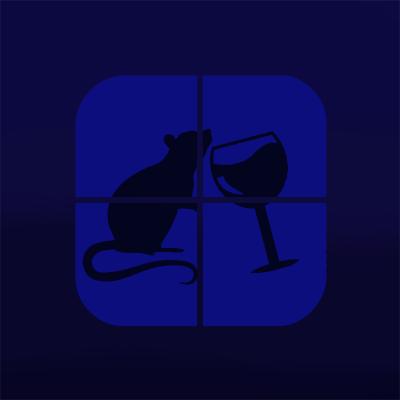

### MiceWine Emulator

MiceWine is a project that aims to run Windows applications and games on Android smartphones.

It uses a customized build of Wine compiled for Android and Box64 to run in the best possible way.

Actually in constant development.

---

### Minimum Requirements

- 4GB RAM
- Vulkan 1.1+
- Android 10+
- 64-bit CPU

### Recommended Requirements

- 8GB RAM
- Vulkan 1.3+ or Turnip Compatible GPU
- Android 12+
- 64-bit CPU

---

### Tested GPUs

- Adreno 610+
- Adreno 710+
- Adreno 830
- Mali G52 MC2
- Mali G610
- Mali G615
- Mali G76
- Mali G925 Immortalis
- PowerVR IMG BXM-8-256

---

### Controller Support

MiceWine Supports Up To 4 Physical Controllers. With XInput and DInput Automatic Mapping.

Any Xbox Like Controller May Works.

Tested with Ipega 9021s, Ipega 9078, Altomex AL-G7, Xbox One Controller, Xbox Series Controller.

---

### Keyboard and Mouse Support

MiceWine Should Work Out of Box with Any QWERTY ABNT2 Keyboard and Mouse.

When Mouse is Captured Press Alt+Q on Keyboard to Release or Press Back on Device.

---

### RootFS Download

You can download the required **RootFS** file from this repository:  
- [MiceWine RootFS Generator](https://github.com/KreitinnSoftware/MiceWine-RootFS-Generator)

---

### Third Party Open Source Applications:

- [Box64](https://github.com/ptitSeb/box64)
- [WineHQ](https://gitlab.winehq.org/wine/wine)
- [Termux-X11](https://github.com/termux/termux-x11)
- [Mesa](https://gitlab.freedesktop.org/mesa/mesa)
